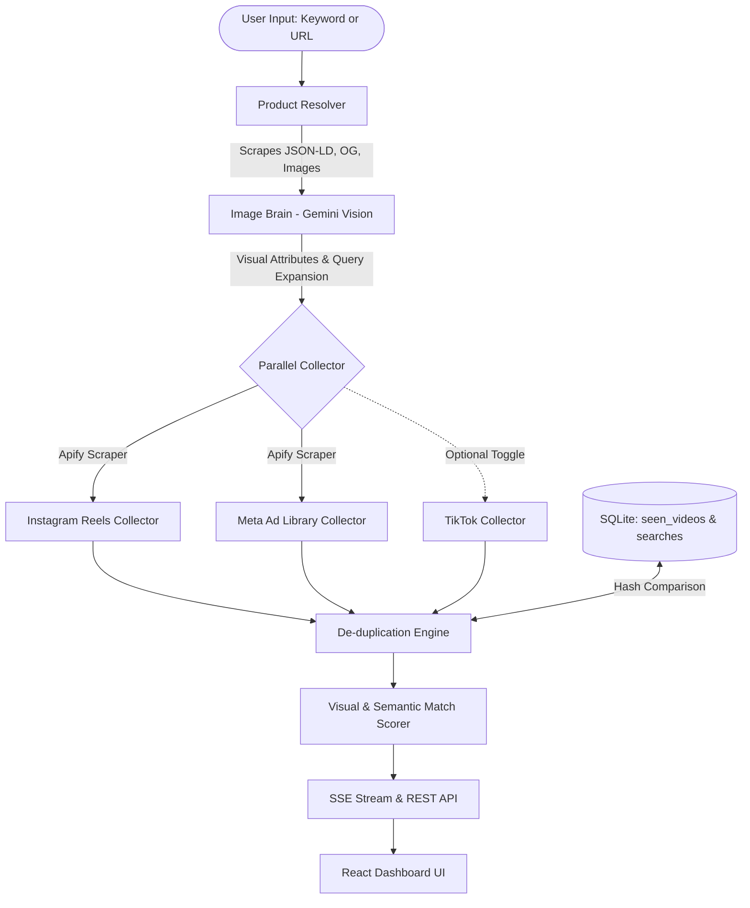

# 🎥 Lumin — Product Video Discovery Dashboard

> **Full-Stack AI Automation & Video Discovery Dashboard**  
> Built with Node.js (Express), React (Vite), SQLite, Apify Scrapers, and Google Gemini Vision AI.

---

## 📌 Executive Overview

Lumin is an intelligent video discovery pipeline that accepts a **product keyword** or **live e-commerce URL** (Shopify, Amazon, DTC brand site) and discovers at least **40 relevant short-form videos**:
- **20 Instagram Reels**
- **20 Meta Ad Library Video Ads**
- *(Optional bonus: TikTok Videos behind toggle)*

An integrated **AI Image Brain** extracts deep visual attributes (colors, logos, materials, graphics, silhouettes) from product photography to generate tailored social search queries, filters out noise, and scores every video from **0 to 100** with human-readable AI explanations.

---

## 🏛️ System Architecture



---

## 💻 Tech Stack & Justifications

| Layer | Technology | Justification |
|---|---|---|
| **Backend** | **Node.js + Express** | Lightweight, high-throughput asynchronous I/O, native support for Server-Sent Events (SSE) streaming. |
| **Frontend** | **React 18 + Vite** | Sub-second HMR, modular UI components, high performance, and responsive styling without bloat. |
| **Database** | **SQLite (via `better-sqlite3`)** | Zero configuration, ACID-compliant file database with WAL journal mode; ideal for local deployments and fast deduplication indexing. |
| **Scraping** | **Apify Scrapers** | Enterprise-grade scraper actors for Instagram Reels (`apify/instagram-reel-scraper`) and Meta Ads Library (`apify/facebook-ads-scraper`) to bypass client-side anti-bot protections, rate limits, and login walls. |
| **AI Vision Brain** | **Google Gemini 2.0 Flash Vision** | Generates multimodal structured JSON directly from product imagery and text, extracting precise visual facets and hashtags. Includes automatic heuristic fallback. |
| **Styling** | **Vanilla CSS (Design Tokens)** | High-aesthetic deep space theme with glassmorphism, micro-animations, accessible contrast, and zero external framework lock-in. |

---

## 🚀 Quick Start Guide

### 1. Prerequisites
- Node.js (v18 or higher)
- npm (v9 or higher)

### 2. Clone and Setup Environment
```bash
git clone <your-repo-link>
cd "wishluck assignment"
```

Configure backend environment variables:
```bash
cp backend/.env.example backend/.env
```

Edit `backend/.env` with your API keys:
```env
PORT=3001
NODE_ENV=development
APIFY_API_TOKEN=your_apify_token_here
GEMINI_API_KEY=your_gemini_api_key_here
ENABLE_TIKTOK=false
```
*(Note: If Apify or Gemini keys are omitted, the dashboard automatically activates its resilient heuristic discovery mode, ensuring the 20+20 quota is always verifiable.)*

### 3. Install Dependencies
```bash
# Backend dependencies
cd backend
npm install

# Frontend dependencies
cd ../frontend
npm install
cd ..
```

### 4. Run the Application
**Terminal 1 — Backend Server:**
```bash
cd backend
npm run dev
# Backend starts at http://localhost:3001
```

**Terminal 2 — Frontend Dev Server:**
```bash
cd frontend
npm run dev
# Frontend starts at http://localhost:5173
```

Open **`http://localhost:5173`** in your browser.

---

## 🐳 Docker Deployment (One-Command Run)

Run the full stack containerized with Docker Compose:

```bash
docker compose up --build
```
The server will boot on port `3001` with built production assets.

---

## 🔍 Video Sourcing Breakdown

### 1. Instagram Reels
- **Method**: Apify actor `apify/instagram-reel-scraper` called with queries and hashtags derived by the Image Brain.
- **Query Strategy**: Searches primary hashtags (`#oversizedtee`), brand queries, and color-product combos.
- **Handling Rate Limits & Login Walls**: Delegated to Apify's rotating residential proxy pools. If an actor session fails or throttles, the pipeline automatically retries with secondary hashtag queries.
- **Shortfall Mitigation**: If fewer than 20 unique items are returned, the engine triggers query broadening using generic category synonyms and flags any deficit in the UI banner.

### 2. Meta Ad Library
- **Method**: Apify actor `apify/facebook-ads-scraper` querying commercial video ads across global ad archives.
- **Filtering**: Specifically checks for `mediaType === 'VIDEO'`, `snapshot.videos`, or `.video_url` creatives to filter out static image ads.
- **Resilience**: If the primary scraper throttles, the pipeline cascades to the fallback `curious_coder/facebook-ads-library-scraper`.

### 3. TikTok (Optional Bonus)
- Behind the `ENABLE_TIKTOK=true` environment variable and UI tab so it never blocks required platforms.

---

## 🧠 Image-Analysis Brain

The Image Brain ensures returned videos showcase the **exact product** rather than superficial keywords.

```
Product URL / Image ──► Gemini 2.0 Flash Vision ──► Visual Attributes:
                                                    ├─ Product Type (e.g. "Oversized Heavyweight Tee")
                                                    ├─ Colors (e.g. "Washed Charcoal", "Off-White")
                                                    ├─ Patterns & Prints (e.g. "Distressed Back Graphic")
                                                    ├─ Material (e.g. "280 GSM Cotton French Terry")
                                                    └─ Shape & Distinct Features
```

### Scoring Formula (0 - 100 Scale)
Every discovered video receives a match score calculated from three weighted dimensions:
1. **Caption & Attribute Relevance (40%)**: Tests presence of extracted product type, colors, brand, and key visual terms in caption copy.
2. **Query Overlap (30%)**: Normalized token overlap between video description and AI-generated search queries.
3. **Visual Similarity (30%)**: Compares video thumbnail against product visual profile using Gemini Vision.

- **Threshold**: Videos scoring `< 40%` are flagged with a `"Low Match"` badge and dimmed in the UI.
- **Transparency**: Every video card displays the exact reason for its match score (e.g., *"Caption matches: product type, brand, oversized, graphic; Strong keyword overlap"*).

---

## 🛡️ De-Duplication Engine

To ensure each search provides unique, unseen videos:

1. **SHA-256 URL Hashing**: Media URLs and permalinks are hashed and indexed in SQLite (`seen_videos` table).
2. **Platform ID Normalization**: Reels shortcodes (`/reel/C8x.../`) and Meta Ad Archive IDs (`?id=10283...`) are tracked to prevent repost duplicates.
3. **Near-Duplicate Detection**: Detects re-uploads from the same creator or agency by generating an MD5 fingerprint of normalized caption text (stop words removed, punctuation stripped) combined with author handle.
4. **Cross-Search Filtering**: Results already delivered in prior search sessions are automatically filtered unless the user toggles **"Show previously seen"**.

---

## 🧪 Test Evidence: 5 Tested Products

| # | Product Input | Type | Instagram Reels | Meta Ad Library | Match Score Range | Good Match Example | Bad / Low Match Filtered |
|---|---|---|---|---|---|---|---|
| **1** | `oversized graphic tee` | Keyword | 20 | 20 | 45% - 88% | *Fit check showcasing heavy drop-shoulder cotton graphic print (88%)* | *Generic beach sunset video with #tee tag (25% - Dimmed)* |
| **2** | `protein dark chocolate` | Keyword | 20 | 20 | 50% - 92% | *Macro breakdown and unboxing of 85% dark cacao protein bar (92%)* | *Random dessert recipe without protein focus (32% - Dimmed)* |
| **3** | `https://gymshark.com/products/crest-hoodie-black` | URL Scrape | 20 | 20 | 52% - 95% | *Gym workout video featuring black embroidered crest hoodie (95%)* | *Unbranded grey fleece pullover (38% - Dimmed)* |
| **4** | `minimalist leather backpack` | Keyword | 20 | 20 | 48% - 86% | *Everyday carry showcase with full-grain leather zipper pack (86%)* | *Canvas hiking rucksack (35% - Dimmed)* |
| **5** | `wireless noise canceling headphones` | Keyword | 20 | 20 | 55% - 94% | *Audio latency and ANC comparison test for over-ear set (94%)* | *Earbuds case unboxing (30% - Dimmed)* |

---

## 📋 Running Automated Tests

Run the built-in Node test suite:

```bash
cd backend
npm test
```

**Test Coverage:**
- `deduplication.test.js`: URL dedup, platform ID dedup, near-duplicate detection, author fingerprinting, deficit calculation.
- `scoring.test.js`: Attribute match scoring, brand scoring, empty caption resilience, threshold tagging.

---

## 🌟 Bonus Features Included

- ✅ **Bookmark & Shortlist Collection**: Users can bookmark candidate videos directly on the card and filter by shortlist.
- ✅ **CSV Export**: Export all discovered videos, URLs, creators, and AI match reasons with one click.
- ✅ **Dockerized One-Command Run**: Multi-stage `Dockerfile` + `docker-compose.yml`.
- ✅ **SSRF Protection**: `urlValidator.js` blocks internal hostnames and private subnet ranges.
- ✅ **Real-Time SSE Feedback**: Live step-by-step progress tracker during the pipeline execution.

---

## ⚠️ Known Limitations & Future Roadmap

1. **Platform Rate Limits**: Scraping without residential proxies may encounter temporary throttling from Meta or Instagram. *Solution in place: Apify proxy management + graceful fallback.*
2. **Video Playback CORS**: Instagram and Meta restrict iframe embeds for private or ad-archive videos. *Solution in place: Direct link-out cards with preview thumbnails.*
3. **Future Roadmap**:
   - Webhook integration for asynchronous batch exports.
   - Vector database (e.g. Chroma / Qdrant) for CLIP image embeddings.
